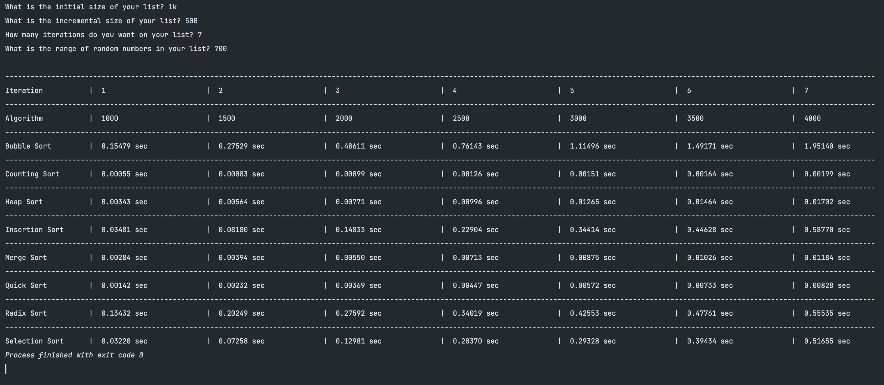
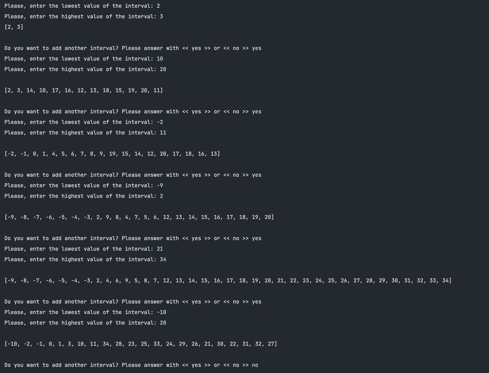
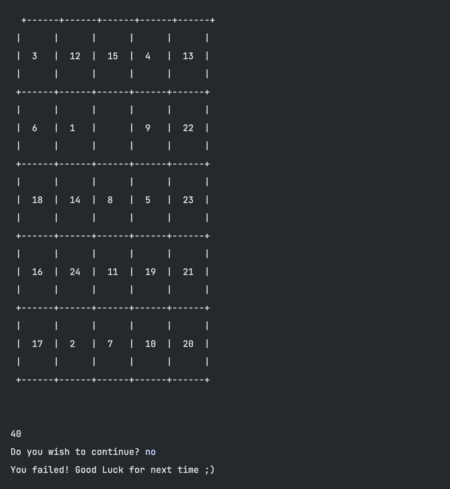

# IMS-AED_Project
College Project - Algorithms & Data Structures Course

 

## 📔 Summary

During our Spring Semester, we learned about Python algorithms and object-oriented programming. 
Our course project is composed by 3 exercises:
- The first one is based on making the learning sorting algorithms compete and if desired creating our sorting algorithms.
- In the second one, we develop a Python program that gets several intervals of integer numbers from the user.  Each time, the user should have an option to either provide a new one or quit the program.
- The third exercise requires a time complexity analysis of the "Sliding Tile Puzzle" in the book “Big book of small python projects”. And then, create a more difficult version of the puzzle (5x5) and make it solve automatically with up to 40 moves, and then continue until the puzzle is solved.

 

## Sorting Algorithms

Python program that makes all the algorithms compete and measure the running time for each of. The input for the algorithms
will be a list of N integers (not sorted) that will grow at every iteration.

### We get these inputs from the user:
- Initial size of the list
- Incremental size of the list
- Number of iterations
- Range of numbers inside the list

### Outputs from the program:
- A matrix with the times (in seconds) for each algorithm.

 

## Intervals

Python program that asks several intervals of integer numbers to the user (negative or positive numbers). Each time, the user has an option to either provide a new interval or quit the program. The intervals form lists of numbers with a limit of -999 or 999.

For each interval given by the user, a continuous list of integer numbers between the
limits of that interval is produced. 

### Intervals can be:
- Connected in relation to the previous intervals, merging into one interval.
- Overlapped or partially overlapping the previous ones.
- Not connected to the previous ones.

The program sorts the intervals in an intercalated way. This is, odd intervals are sorted
ascendent, and even intervals are randomly sorted. The overlapped or partially overlapping
intervals will delete the overlapping part.

 

## 🧩 Sliding Tile Puzzle

On the book “Big book of small python projects” we solved the Sliding tile puzzle. We also did a time complexity analysis.

### Our programs runs:
- A more difficult 5 × 5 variant of the sliding tile puzzle.
- A “solve automatically” mode, which saves each arrangement of the tiles and then attempts up to 40 random moves.

 

## Suggestions

All suggestions are appreciated so that we can improve and optimize these scripts.
